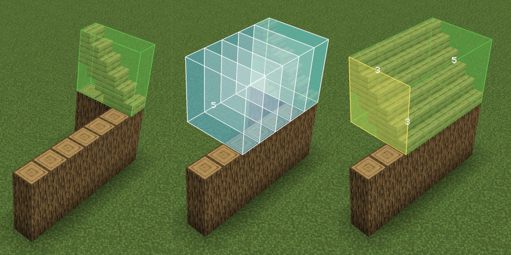
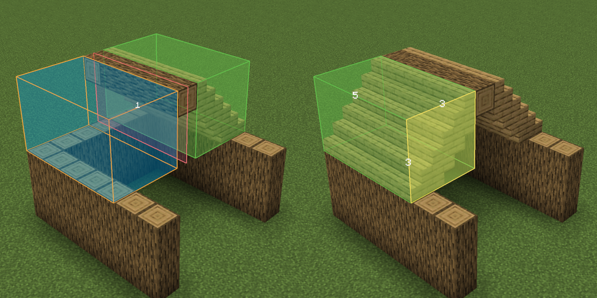

# User Guide

This guide should teach you how to use Makkit. Makkit is meant to be simple,
so we've kept everything you need to know in this one document.

Getting started with Makkit is easy. To start editing, place down a 
selection box with the New Box key (default: `B`) while selecting a block
near you. This should create a Selection Box that we can edit the world
with.

From there, you should be able to easily move and resize the box (defaults: 
*Right Click* (`RMB`) and *Left Click* (`LMB`)). 

**Note**: *If you want to edit the blocks inside of the Selection Box, you can
toggle your placement mode by hitting the Placement Mode key (default: `Z`)!*

## Tools

### Fill Area Tool

The Fill Area tool (default: R) is used to fill a selection box with blocks.
With this tool, you can set an entire selection to be whichever block you have
in your hand! If you aren't holding anything in your hand, then it sets the entire
selection to Air.

If you are holding a block that can be rotated, the rotation of the resulting blocks
will match whichever face of the selection box you are looking at.

**Note**: *Most blocks cannot be rotated up or down, so if you are looking at either
of those faces, then the resulting blocks will always face North.*

### Fill Walls Tool

The Fill Walls tool (default: `C`) is used to fill the walls inside of a selection
box with blocks. Otherwise, it acts exactly like Fill Area.

### Pattern/Repeat Tool

The Pattern tool (also called the Repeat tool) is used to repeat a selection
of blocks in a specified direction. To use it, tap and hold down the Pattern
key (default: `X`) on one face of a selection box, and drag to repeat the
contents of the selection in that direction.

One good example of this is for creating
a roof. Simply create a slice of the roof on the end and select it. Then,
you can hold down on the Pattern key and drag. Letting go will
repeat the pattern in the specified direction, therefore completing the roof.

This can tile blocks in any direction. You can even build the walls
one block high and then select them and repeat them upwards to form the
walls!

### Mirror Tool

The Mirror tool (default: `N`) is used to mirror a selection over a plane.
To use it, tap and hold down on a face of your selection box. A plane
should appear, and you can drag away from the face to adjust how far
away the mirrored blocks should be placed,

This can again be used to easily create roofs and other symmetric
structures.

### Copy & Paste

Makkit has a built in Copy & Paste tool as well. To copy something,
mouse over one of the *side* faces of a selection and hit the Copy key
(default: `Ctrl+C`) to copy it. It must be a side face, not a top or bottom
face, because we also save the rotation when pasting the selection later on.

Now, feel free to move your selection box around however you please. To paste
your selection later on, just make the selection the same size as it was when
you copied it. If it's the same size, the selection box should glow purple.
Now, just look at the side face, and hit the Paste key (default: `Ctrl+V`). 

The way that selections get rotated when pasting depends on which face you
were looking at it when you copied it. For example, if you made a fancy statue
and then copied it while looking at the front of the statue, then when you
paste the statue later on it should still be looking at you!

## Undo & Redo

Makkit also has the ability to undo and redo operations done by all the
tools mentioned so far. To do so, just hit the Undo key (`Ctrl+Z`), or the
Redo key (`Ctrl+Y`). Each player can undo up to a maximum of 50 times!

## Multi-Block Palettes

Often times, you'll find yourself wanting to fill an area with several
types of blocks. If, for example, you wanted to fill a selection with
both stone bricks and cracked stone bricks, you would want to use a
Multi-Block Palette. To create a palette, just hold down on the
Multipalette key (default: `V`) and scroll through your hotbar. Anything
you scroll past should be added to your palette and highlighted.

With a palette, you can control how areas get filled. If you are holding
Dirt and Cobblestone, then filling an area would cause it to get filled with
50% Dirt and 50% Cobblestone. If you are holding a Gold Block, an Iron Block,
and a Diamond Block (3 items), the new area will get filled with roughly 1/3 
of each at random.

By default, the weight of each item is evenly random. If you want to weight
each item in your palette differently, you can turn on `Palette Weighting` in 
the config.

**Note**: Special rules for palette weighting:
* Sticks count as Air, since Air can't be stacked.
* Water and Lava buckets count as Water and Lava fluid blocks.
* All items without a block equivalent will be skipped (e.g. Swords)

## Air Masks

Sometimes, you need a little bit more flexibility when deciding which blocks
you want to be affected by different tools. Air Masks help solve this problem.
By default, whenever you use a tool, it affects all blocks in the selection.
If you switch the current Air Mask (default: `G`), it will change which blocks 
get affected.

Air Mask options:
* All Blocks - the default air mask, your tools affect all blocks.
* Only Air - your tools will only affect air blocks.
* Exclude Air - your tools will affect all blocks, EXCEPT air blocks.

So, for example, you could create a new box in an empty area and use
Fill Walls to create walls made out of Stone Bricks, and then switch
the Air Mask to "Only Air" and fill the area with Cobwebs - this would
only fill the area inside of the walls with Cobwebs!

When the Air Mask is changed from the default setting, it will show up
at the top of the screen to remind you how your selections are being
masked.
